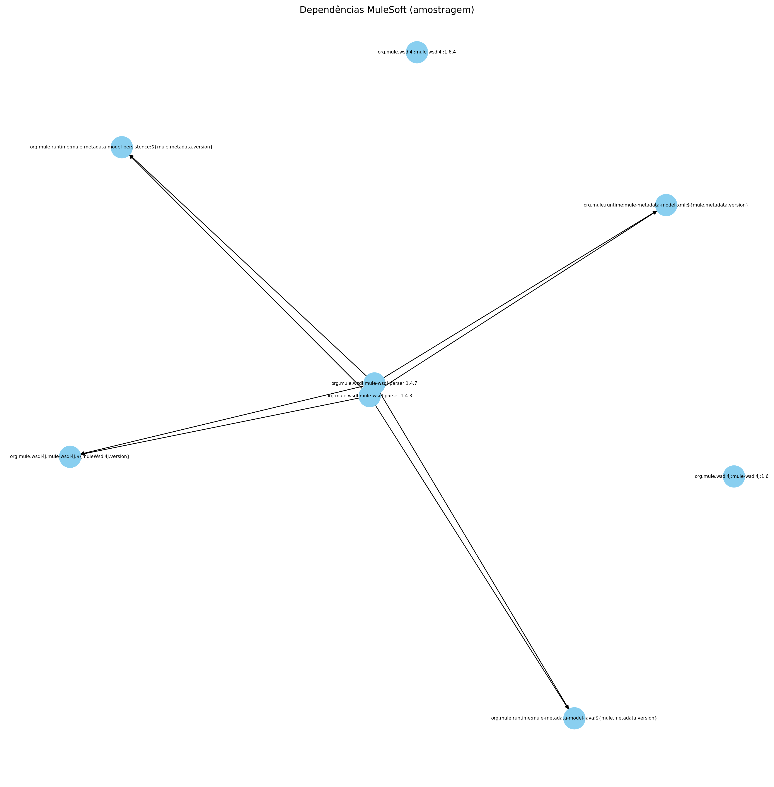

# 🔍 MuleSoft Core Dependencies Mapper (v1.0)

<p align="center">
  
</p>

<p align="center">
  <a href="https://www.python.org/"></a>
  <a href="https://networkx.org/"></a>
  <a href="https://matplotlib.org/"></a>
  <a href="https://scipy.org/"></a>
</p>

---

## 📦 Visão Geral

Este projeto em **Python** realiza uma varredura automatizada no repositório Maven local (`~/.m2/repository`), capturando artefatos **MuleSoft** (como `org.mule.*` ou `com.mulesoft.*`) e suas **dependências diretas**, gerando um grafo orientado e exportando-o como imagem `.png`.

Ideal para engenheiros de integração, arquitetos MuleSoft e times de DevOps que desejam **visualizar relacionamentos entre bibliotecas MuleSoft** de maneira rápida, clara e visual.

---

## 🧰 Funcionalidades

| Recurso                       | Descrição                                                             |
| ----------------------------- | --------------------------------------------------------------------- |
| 📂 Varredura inteligente      | Procura `pom.xml` e JARs com POMs embutidos via `META-INF/maven`.     |
| 🧠 Foco exclusivo MuleSoft    | Filtra apenas `groupId` que começam com `org.mule` ou `com.mulesoft`. |
| 🎯 Geração de grafo orientado | Usa `networkx.DiGraph` para representar relações pai → dependente.    |
| 🖼️ Exportação como PNG       | Gera visualização automaticamente em `grafo_mulesoft.png`.            |
| ⚡ Limite de POMs configurável | Argumento `--max` para limitar a quantidade de artefatos MuleSoft.    |
| ✅ Log bonito                  | Logs visuais com emoji e cores usando `colorama`.                     |

---

## 🖼️ Exemplo Visual

<p align="center">
  
</p>

---

## 🚀 Como Usar

### 1. Clone o projeto

```bash
git clone https://github.com/SUA_ORG/mulesoft-core-dependencies-mapper.git
cd mulesoft-core-dependencies-mapper
```

### 2. Execute o script principal

```bash
python mulesoft-core-dependencies-mapper.py
```

### 3. Parâmetros opcionais

| Flag    | Descrição                                      | Exemplo                    |
| ------- | ---------------------------------------------- | -------------------------- |
| `--max` | Número máximo de artefatos MuleSoft a mapear   | `--max 10`                 |
| `--out` | Caminho para salvar o grafo como imagem `.png` | `--out /tmp/meu_grafo.png` |

---

## ⚙️ Requisitos

* **Python** 3.8 ou superior
* **Bibliotecas instaladas automaticamente**:

  * `networkx`
  * `matplotlib`
  * `scipy`
  * `colorama`

---

## 📂 Estrutura do Projeto

```text
mulesoft-core-dependencies-mapper/
├── mulesoft-core-dependencies-mapper.py  # Script principal
├── grafo_mulesoft.png                    # Imagem gerada (exemplo)
└── README.md                             # Documentação do projeto
```

---

## 👨‍💼 Desenvolvedor Responsável

* **Leonel Dorneles Porto**
* **Email:** [leonel.d.porto@accenture.com](mailto:leonel.d.porto@accenture.com)
* **LinkedIn:** [https://br.linkedin.com/in/leonel-dorneles-porto-b88600122](https://br.linkedin.com/in/leonel-dorneles-porto-b88600122)
* **Organização:** Accenture / Telefônica VIVO

---

<p align="center">
  
</p>

---
